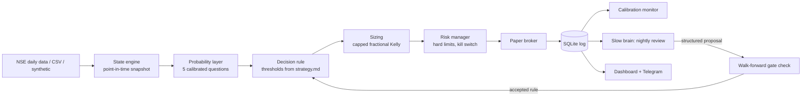

# OctoQuant: Planning Document

A cloud-hosted, risk-first research and paper-trading system for NSE equities.
Status of this document: v1.0, written alongside the first build.

---

## 1. Summary

OctoQuant turns a language model into the *research and review* layer of a trading
system, and keeps every *decision that touches money* in deterministic, tested code.

The system watches NSE equities at the daily close, converts market state into a
compact snapshot, asks a bank of calibrated probability models fixed questions,
and acts only when every probability clears a threshold that was validated
out of sample. Sizing is a capped fraction of Kelly. Hard risk limits are enforced in
code and cannot be overridden by any model. This build trades on paper only.

## 2. First-principles breakdown

| Question | Answer | Design consequence |
|---|---|---|
| What is a trade, fundamentally? | A bet that expected return exceeds cost and risk. | Every signal is a calibrated probability, and costs are modelled explicitly. |
| Where can a language model add value? | Research, coding, review, summarising failure. It is slow, non-deterministic and cannot be audited per decision. | It sits in the *slow loop* only. It proposes; code disposes. |
| Where must it not be trusted? | Order sizing, risk limits, anything needing exact, repeatable numerics. | Sizing and risk are plain functions with unit tests. |
| How does a backtest lie? | Look-ahead, overfitting, ignoring costs, selecting on the test set. | Point-in-time snapshots, walk-forward training, cost and slippage model, one-shot final test, null-data test. |
| How does a live system lose money? | Over-sizing, correlated positions, stale data, silent failure, model drift. | Position and exposure caps, daily loss limit, drawdown kill switch, data freshness checks, calibration monitoring. |
| What edge is realistic with free data? | Modest, slow, and easy to destroy with costs. | Daily bars, low turnover, long-only, and strict acceptance gates. A failed gate is a valid result. |

## 3. Constraints discovered during planning

These were measured in the build environment, not assumed.

| Resource | Result from the cloud sandbox |
|---|---|
| PyPI, GitHub | Reachable. |
| nseindia.com, nsearchives.nseindia.com, niftyindices.com | Blocked by the sandbox egress policy (HTTP 403 on CONNECT). |
| Yahoo Finance, Stooq, Alpha Vantage, Twelve Data, Binance, CoinGecko, Upstox, Kite, Hugging Face | Blocked by the same policy. |

Consequences:

1. The NSE adapter is written against the public `jugaad-data` library and **could not be run
   against live NSE in the build session**. It must be exercised from an environment that can reach NSE.
2. Development and tests use a synthetic market generator and CSV import. Results on synthetic data
   demonstrate that the machinery works. They are not evidence of a tradable edge.
3. Free NSE history is end-of-day. Long intraday history needs a broker API (for example Kite Connect,
   Upstox, Angel One, Dhan). The engine is timeframe-agnostic so an intraday feed can be added later.

## 4. Deliberate departures from the source prompt

| Source prompt said | This build does | Reason |
|---|---|---|
| Fast model called on every candle, sub-second | Called at every daily close | Free NSE data is end-of-day. Sub-second latency has no meaning at daily frequency. |
| Order book imbalance and spread in the snapshot | Delivery %, close-location value, volume z-score, gap | Level-2 data is not in free feeds. These are the nearest free proxies. |
| Opus rewrites `strategy.md` each night | Opus proposes a *structured* rule change. Code validates it and re-runs the walk-forward gates before it is accepted. | An unconstrained nightly self-edit is a direct path to overfitting. |
| Trade on Alpaca or an exchange | Paper broker only. No live order adapter exists. | The prompt itself requires paper first. Live trading needs a broker adapter, which is out of scope here. |
| Long and short | Long-only cash equity | Shorting delivery positions is not available to retail on NSE (assumption: verify with your broker). |

## 5. Capabilities

| ID | Capability | What it does | Status in v1 |
|---|---|---|---|
| C1 | Data layer | NSE daily OHLCV, VWAP and delivery % for stocks and indices via `jugaad-data`; CSV import; synthetic generator; on-disk cache. | Built. NSE adapter untested against live NSE. |
| C2 | State engine | Point-in-time snapshot per symbol and day: multi-horizon returns, realised volatility, trend slope, VWAP gap, volume z-score, delivery %, close location, gap, index regime context. | Built. |
| C3 | Probability layer | Five fixed questions answered by calibrated classifiers trained walk-forward. Pluggable interface so an external model such as the Jev SDK can replace it. | Built. Jev SDK not integrated (API unverified). |
| C4 | Strategy research | Train, validation and test split. Parameters selected on validation. A single final test. Winner written to `strategy.md`. | Built. |
| C5 | Backtest engine | T+1 open execution, gap-aware stops, ATR targets, time stops, Indian delivery cost model, slippage. | Built. |
| C6 | Sizing | Capped fractional Kelly using the calibrated probability, zero below a cutoff, zero when calibration fails. | Built. |
| C7 | Risk manager | Max position size, max open positions, gross exposure cap, daily loss limit, max drawdown, persistent kill switch. | Built. |
| C8 | Paper trading | Paper broker, daily runner, SQLite decision and fill log. | Built. |
| C9 | Calibration | Brier score, expected calibration error, reliability curve, recalibration. Every decision is logged with its outcome. | Built. |
| C10 | Slow brain | Nightly review of fills and misses. Finds the worst loss cluster and proposes one rule. Uses the Anthropic API when a key is set, a deterministic reviewer otherwise. | Built. |
| C11 | Dashboard and alerts | Live web dashboard of signals, probabilities, actions and results. Telegram alerts for fills, errors, escalations and kill-switch events. | Built. |
| C12 | Preflight | Produces the "What could blow up this account?" report and refuses to clear until every gate is clean. | Built. |
| C13 | Cloud | Dockerfile, GitHub Actions CI, deployment guide. | Written. Docker image and workflows were not run in the build session. |

Out of scope for v1: live order placement, intraday and tick data, options and futures, shorting,
portfolio optimisation beyond per-name caps.

## 6. Architecture

Three layers that never overlap:

| Layer | Role | Cadence | Authority |
|---|---|---|---|
| Slow brain (Opus, optional) | Research, review, rule proposals | Nightly | Proposes only |
| Probability layer | Calibrated answers to fixed questions | Each daily close | Advises only |
| Deterministic code | State, thresholds, sizing, vetoes, orders | Each daily close | Decides |

## 7. The five probability questions

Each question is a separate classifier so one factor is isolated and the code can combine them.

| Question | Type | Label definition |
|---|---|---|
| Regime | Choice: bull, chop, bear | Forward 20-day index trend, scaled by trailing volatility. |
| Direction | Choice: up, flat, down | Forward H-day return versus a cost-adjusted band. |
| Buying pressure | Yes or no | Next-day close above VWAP with above-median volume. |
| Setup quality | Score 0 to 1 | Forward return divided by realised volatility, rank-scaled. |
| Risk state | Choice: calm, normal, stressed | Forward volatility bucket. |

A trade fires only when direction, buying pressure and setup quality clear their thresholds
and the regime and risk state are acceptable.

## 8. Risk controls

All enforced in code, before every order, with unit tests.

| Control | Default | Behaviour on breach |
|---|---|---|
| Max position size | 10% of equity | Order is cut to the cap. |
| Max open positions | 8 | New entries rejected. |
| Max gross exposure | 80% of equity | New entries rejected. |
| Daily loss limit | 2% of equity | New entries halted for the day. |
| Max drawdown | 15% from peak | Kill switch: flatten at next open, halt trading. |
| Kill switch | Persistent flag in the database | Stays on until a human clears it. |
| Calibration gate | ECE and sample size thresholds | Sizing set to zero. |
| Data freshness | Latest bar must be the latest trading day | Run aborts with an alert. |
| Manual approval | Orders above a configurable rupee size | Held until approved. |
| Credentials | Trade-only keys, withdrawals off, secrets in environment only | Never logged. |
| External text | Headlines and feeds treated as data | Never executed as instructions. |

## 9. Acceptance gates

A strategy is accepted only if it clears all of these on the held-out test period.
The thresholds come from the source prompt and are configurable.

| Gate | Threshold |
|---|---|
| Sharpe ratio (annualised, daily returns) | Above 1.5 |
| Maximum drawdown | Below 15% |
| Hit rate (per trade) | Above 55% |
| t-statistic of mean daily return | Above 2.0 |
| Test span | At least 2 years, covering more than one regime |
| Trades in the test window | At least 100 (raised from 30 after a noise run cleared the other gates on 23 trades) |
| Costs and slippage | Applied |

These are strict for a long-only daily equity strategy. Failing them is an expected, valid outcome.
The harness is also tested on pure random-walk data and must reject it.

## 10. Indian market specifics

| Item | Treatment |
|---|---|
| Session | 09:15 to 15:30 IST. The daily job runs after the close. |
| Execution | Signal at close of day t, fill at open of day t+1 with slippage. |
| Costs (delivery) | Brokerage, STT, exchange charges, SEBI fee, stamp duty, GST, DP charge. **Rates are assumptions and must be verified against your broker's current contract note.** All are configurable. |
| Circuit limits | Positions in names that hit circuit are not assumed exitable on that day. |
| Holidays | Config-driven list. Must be maintained by the operator. |
| Universe | NIFTY 50 constituents by default, configurable. |

## 11. Build phases

| Phase | Deliverable | Gate to proceed |
|---|---|---|
| 1. Spec | This document | Reviewed |
| 2. Foundation | Config, data layer, state engine | Unit tests pass, no look-ahead test passes |
| 3. Models | Probability layer, calibration | Calibration tests pass |
| 4. Engine | Backtest, costs, sizing, risk | Risk and kill-switch tests pass |
| 5. Research | Walk-forward, gates, `strategy.md` | Null-data test rejects noise |
| 6. Runtime | Paper broker, runner, dashboard, alerts | End-to-end paper run on synthetic data |
| 7. Slow brain | Reviewer, rule validation | Proposal validator tests pass |
| 8. Cloud | Docker, CI, deploy guide | CI green |
| 9. Real data | Run on live NSE data from a reachable host | Operator step |

## 12. Assumptions and open items

| Item | Status |
|---|---|
| Cost rates (STT, stamp duty, exchange charges, DP charge) | Assumption. Verify before trusting any P&L. |
| NSE may block cloud and datacenter IP ranges | Assumption from common reports. Untested here. Mitigation: cache data, or use a broker feed. |
| `jugaad-data` stays compatible with NSE's endpoints | Dependency risk. NSE changes endpoints without notice. |
| The Jev SDK | Could not be verified. The probability layer is an interface, so it can be added later. |
| Survivorship bias | The default universe is today's NIFTY constituents. Past results are flattered. |
| Multiple testing | 150 parameter sets are searched on validation. The count is recorded in `strategy.md`. Acceptance is evidence, not proof. |
| Opus 5.5 model identifier | Configurable. Defaults to `claude-opus-5-5`. |
| Shorting not available for delivery positions | Assumption. Verify with your broker. |
| This is research software, not financial advice | Paper trading only. Past or simulated performance does not predict results. |

## 13. Build results

Measured during the build. All results are on synthetic data.

| Check | Result |
|---|---|
| Automated tests | 65 pass (data, no-look-ahead, engine, risk, research, runtime, dashboard, review, preflight). One full-size test is marked slow. |
| Live runner versus backtest | Equity matches to floating-point precision over 15 replayed days, because both use one simulator step. |
| Harness on markets with no edge | 0 of 4 seeds accepted at full size. All four failed the Sharpe and t-statistic gates. Four runs is too few to state a false-positive rate. |
| Harness on a strong planted edge | 2 of 4 seeds accepted. The other two missed narrowly (one at Sharpe 1.49 against the 1.5 bar). |
| Calibration | Expected calibration error under 0.01 for buying pressure and setup quality, about 0.04 for direction, after replacing isotonic recalibration with a Platt-style scaler. |
| End-to-end demo | Research, 30 held-out days replayed through the paper runner, daily report, preflight. Preflight correctly stays NOT CLEARED. |

Design changes forced by what the build found:

1. Threshold grids are expressed as lift over each question's training-window base rate. The first
   version used absolute probabilities, and the buying-pressure label (base rate about 19%) could never reach them, so almost nothing traded.
2. Kelly sizing uses P(win) = P(up) + half of P(flat), because P(up) means "up beyond the cost band" and understates the chance a trade ends profitable.
3. The minimum trade count rose from 30 to 100 after a no-edge market cleared the t-statistic and hit-rate gates on 23 trades.

Not verified in the build environment: live NSE fetches, the Docker image, the GitHub Actions workflows, and the Anthropic API path (tested only with a stub client).

## 14. Sources

- `jugaad-data` (PyPI, version 0.35.9 installed during the build): NSE historical data library. Inspected directly: `stock_df`, `index_df`, and the delivery % field.
- Source prompt: tweet by @RohOnChain (screenshot provided by the user). Claims in it, including the model name and the Jev and AgentKit components, are unverified.
- Network reachability table: measured from the build sandbox on 2026-10-04.
