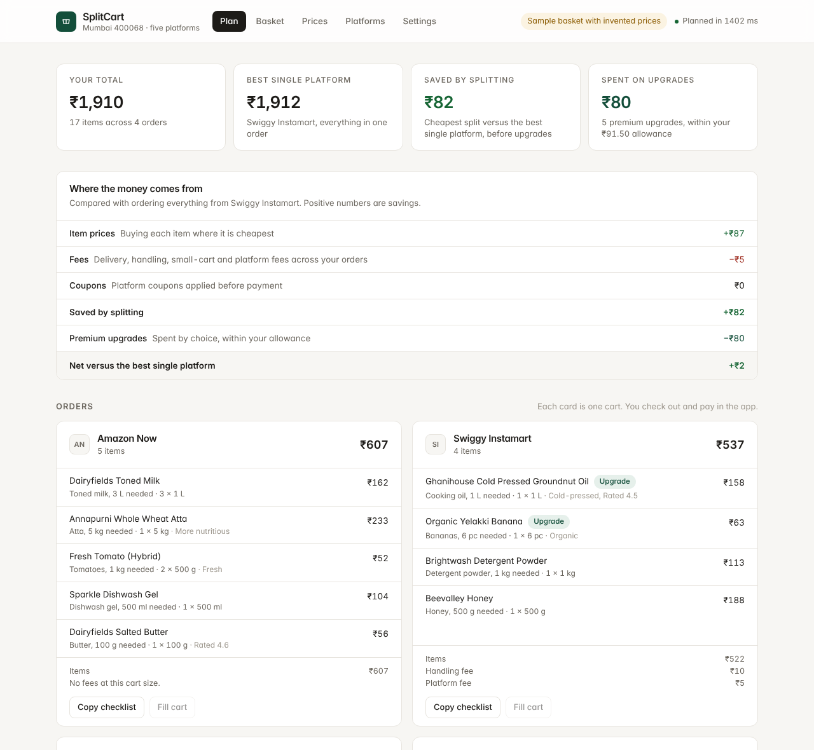

# SplitCart

SplitCart splits a grocery list across Blinkit, Zepto, Swiggy Instamart, Flipkart Minutes and Amazon Now for the lowest total, after every fee, minimum order and platform coupon. It then spends a small allowance, 5 percent of the basket by default, on premium upgrades such as cold-pressed oil or organic dal. You check out and pay in each app yourself.

It is a personal tool for one household (pincode 400068). Plans are computed on your own device.

The product plan is in the [Quick-Commerce Basket Optimiser plan](https://claude.ai/code/artifact/4ccd7e0f-2935-4f4b-b1c0-8fc652fdcd02).



## Run it

Requires Node.js 22.12 or later.

```sh
cd splitcart
npm install
npm run dev        # web app at http://localhost:5173
```

Other commands:

| Command | What it does |
| --- | --- |
| `npm test` | Engine and extension tests |
| `npm run typecheck` | Type-checks every package |
| `npm run build` | Production build of the web app and the extension |
| `npm run plan` | Plans the sample basket in the terminal |
| `npm run plan -- --csv sheet.csv --basket B01` | Plans one basket from a Phase 0 item sheet |

## What is in the folder

| Path | Contents |
| --- | --- |
| `packages/engine` | TypeScript library: cost model, optimiser, quality scoring, CSV import, sample data |
| `apps/web` | React web app (Vite, Tailwind CSS). The solver runs in a Web Worker |
| `apps/extension` | Chrome extension skeleton: human-paced action queue, guardrails, adapter interface |

## How a plan is made

1. **Candidates.** For each list line, every in-stock listing in the right unit becomes a candidate, bought in whole packs that cover the quantity. A pinned brand filters out other brands.
2. **Stage 1, cheapest plan.** A mixed-integer program, solved with [HiGHS](https://highs.dev/) compiled to WebAssembly, picks one candidate per line. It minimises item prices plus delivery, small-cart, handling, platform and surge fees, minus the best platform coupon on each order. It respects each platform's minimum order value, an optional cap on the number of orders, and an optional cost per extra delivery (default 0).
3. **Stage 2, best quality within the allowance.** It maximises total quality while keeping the basket within the stage-1 cost plus the allowance. No line may drop below its stage-1 quality, and a swap counts only if it adds at least 8 quality points.
4. **Stage 3, cheapest way to reach that quality.** This removes any spend that stage 2 did not need.
5. **Baselines.** Each platform's own cheapest cart for the whole list. The headline saving is measured against the best of these, before upgrades; upgrade spend is shown separately.

Quality scores run from 0 to 100. Traits found in the product name or tags score up to 60: organic, cold-pressed, pesticide-free, A2, more nutritious, premium and others, with frozen and palm oil scored negatively. The rating, adjusted for the number of ratings, adds up to 20, and your brand tiers add up to 20. All of it is editable on the Settings tab.

## Data

- **Sample data.** The app opens with a made-up basket of about Rs 2,000. The brands are fictional and the prices are invented. The header shows a "Sample basket" label until you import real data.
- **Fees.** Starting fee rules are indicative figures from public reports and are not verified. Amazon Now values are placeholders. Edit them on the Platforms tab to match each app's bill summary at your pincode.
- **Phase 0 item sheet.** Import it as CSV on the Prices tab. The columns are: Basket, Platform, List line, Product as listed, Brand, Pack size, Price (Rs), Rating, Ratings count, In stock, Tags. Write list lines as `Paneer 200 g, any brand` or `Butter 100 g, only Dairyfields`. Log premium alternatives as extra rows under the same list line. A template can be downloaded from the Prices tab.

## Browser extension (skeleton)

`apps/extension` builds to `apps/extension/dist`. Load it unpacked from `chrome://extensions` with developer mode on. It does not fill carts yet: every platform adapter is marked pending until the Phase 0 checks are done (desktop web ordering at 400068, whether web carts appear in the phone app, and each platform's terms). Until then, use **Copy checklist** on each order card.

What is already built and tested:

- **Pacer.** Runs one action at a time, with log-normal pauses (median 2.5 s before browsing, 5 s before adding to cart), a longer 15 to 40 s break every 6 to 10 actions, and a cap of 150 actions per session. It keeps load at the level of manual use. It does not disguise the browser or get past verification challenges.
- **Guardrails.** Only search, read and add-to-cart actions are allowed. Checkout, payment and order-placement URLs are refused. A page that looks like a verification challenge stops the session and hands control back to you.

Pacing reduces the chance of an account restriction but does not remove it: automated use may still break a platform's terms.

## Tests

- 15 engine tests. They include the worked example from the plan document (Rs 1,922 across three platforms against Rs 1,955 for the best single platform), and a property test that checks the optimiser against brute force on 60 random baskets. That test also checks that upgrades stay within the allowance and never lower quality, and that the cheapest split never costs more than any single platform.
- 6 extension tests covering pacing bounds, breaks, ordering, stop and session caps, and guardrails.

`.npmrc` sets `legacy-peer-deps` to work around an npm 10.9 crash ("edgesOut") with Vitest 4's optional peers. npm 11 does not need it.
